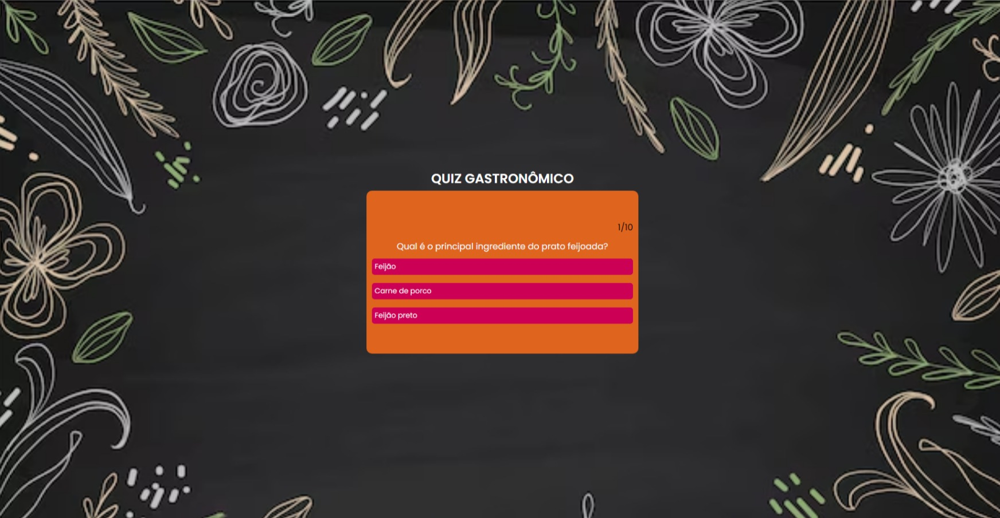

# Quiz Gastronômico Brasileiro

Bem-vindo ao Quiz Gastronômico Brasileiro! Este é um jogo educativo que desafia seus conhecimentos sobre a rica culinária brasileira. Teste seu domínio sobre pratos típicos, ingredientes e tradições culinárias do Brasil enquanto se diverte!

## Tela Inicial

## Como Jogar

1. **Clone o Repositório:** Clone este repositório em sua máquina local.

2. **Abra o Quiz:** Navegue até o diretório do projeto e abra o arquivo `index.html` em seu navegador da web preferido.

3. **Responda às Perguntas:** Leia atentamente cada pergunta e selecione a resposta que você acredita ser correta. Cada pergunta possui uma única resposta correta.

4. **Verifique sua Pontuação:** Ao final do quiz, sua pontuação será exibida, mostrando quantas respostas corretas você acertou.

## Tecnologias Utilizadas

- HTML
- CSS
- JavaScript

## Contribuições

Contribuições são bem-vindas! Se você tiver sugestões de novas perguntas, melhorias no código ou correções, sinta-se à vontade para abrir uma issue ou enviar um pull request.
